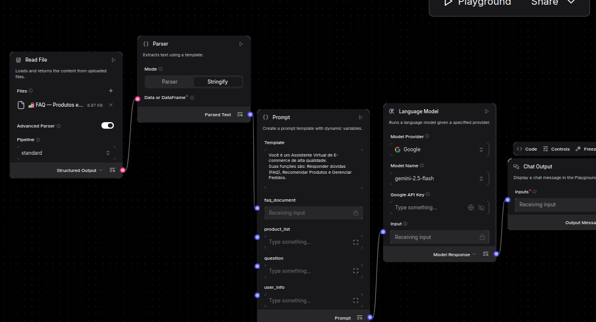

# 🤖 AI Customer Support Automation for Ecommerce

## Sobre o Projeto

Sistema de atendimento inteligente para e-commerce que utiliza IA Generativa para automatizar dúvidas frequentes, recomendações de produtos, consultas de pedidos e envio de emails.

O projeto foi desenvolvido como um MVP funcional com foco na redução do tempo operacional, melhoria da experiência do cliente e validação rápida de soluções baseadas em IA utilizando Langflow, Gemini e Flask.

Além da automação do atendimento, a arquitetura permite testar e comparar diferentes modelos de linguagem, facilitando análises de desempenho, qualidade das respostas e custos de operação.

---

## Demonstração

https://github.com/user-attachments/assets/159e9a24-28cd-4594-a95c-5a7d6bd59c9c

## Fluxo Langflow

<p align="center">
  
</p>

# 📌 Objetivo do Projeto

Construir um sistema capaz de automatizar partes do atendimento ao cliente em ecommerce através de IA, permitindo:

-Reduzir o tempo gasto com atendimentos repetitivos
-Melhorar a experiência do cliente com respostas mais rápidas
-Automatizar processos operacionais
-Facilitar a experimentação e comparação entre diferentes modelos de IA
-Demonstrar uma arquitetura de integração entre IA Generativa e aplicações web

---

# 🚀 Tecnologias Utilizadas

- Python
- Flask
- Langflow
- Gemini
- SMTP / Gmail
- HTML
- TailwindCSS
- Jinja2
- Docker

---

# 🧠 Arquitetura da Solução

A aplicação foi organizada seguindo princípios de:

- Separação de responsabilidades
- Clareza de fluxo
- Manutenção simplificada
- Escalabilidade futura

---

# 📁 Estrutura do Projeto

```bash
project/
│
├── controllers/
│   └── processamento do fluxo e regras da aplicação
│
├── services/
│   └── integrações externas e lógica de negócio
│
├── database/
│   └── dados simulados de usuários e pedidos
│
├── templates/
│   └── renderização HTML com Jinja
│
├── static/
│   └── arquivos estáticos da interface
│
├── utils/
│   └── funções auxiliares
│
└── app.py
```

---

# 🔄 Fluxo da Aplicação

```text
Usuário
   ↓
Flask (Backend)
   ↓
Langflow + Gemini
   ↓
Resposta estruturada da IA
   ↓
Backend interpreta intenção
   ↓
Execução de ação automática
   ↓
Envio de email / recomendação / resposta
```

---

# ⚙️ Funcionalidades Implementadas

## ✅ Atendimento Automatizado

O sistema utiliza IA para responder dúvidas frequentes relacionadas a:

- Status de pedidos
- Informações de entrega
- Políticas da loja
- Recomendações de produtos

---

## ✅ Recomendação de Produtos

Com base na intenção identificada pelo modelo, o sistema consegue sugerir produtos automaticamente.

---

## ✅ Envio Automático de Emails

A aplicação integra SMTP/Gmail para envio automático de emails contendo:

- Atualização de pedidos
- Informações solicitadas pelo cliente
- Recomendações

---

## ✅ Respostas Estruturadas da IA

O sistema utiliza respostas estruturadas para:

- Identificar intenção do usuário
- Definir ações automaticamente
- Garantir previsibilidade no fluxo
- Conectar IA com execução operacional

---

# 🧩 Integração IA + Backend

A arquitetura foi desenhada para separar claramente:

## IA Responsável Por

- Interpretar mensagens
- Identificar intenções
- Estruturar respostas
- Direcionar o fluxo da aplicação

---

## Backend Responsável Por

- Regras de negócio
- Execução de ações
- Consulta de dados
- Envio de emails
- Renderização da interface

---

# 🛠️ Decisões Técnicas do MVP

## Flask

Escolhido pela simplicidade, velocidade de desenvolvimento e facilidade de integração com serviços externos.

---

## Langflow

Utilizado para organizar visualmente o fluxo da IA e acelerar prototipação e testes.

---

## Respostas Estruturadas

A decisão de utilizar respostas estruturadas foi essencial para transformar respostas da IA em ações reais do backend.

Isso tornou o sistema mais previsível, automatizável e escalável.

---

## Organização em Camadas

A divisão entre:

- controllers
- services
- database
- utils

foi adotada para melhorar:

- organização
- legibilidade
- manutenção
- reutilização de código

---

# 📈 Problemas que o Projeto Resolve

## ⏱️ Redução de Tempo Operacional

Automatiza tarefas repetitivas do atendimento ao cliente.

---

## 💰 Redução de Custos

Diminui a necessidade de intervenção manual em processos simples e recorrentes.

---

## 📦 Escalabilidade no Atendimento

Permite atender múltiplos usuários simultaneamente.

---

## ⭐ Melhor Experiência do Cliente

Entrega respostas rápidas, automatizadas e contextualizadas.

---

# 🔮 Possíveis Evoluções Futuras

* Desacoplamento dos IDs internos dos componentes Langflow
* Configuração dinâmica dos componentes do fluxo
* Suporte a múltiplos provedores de LLM
* Comparação de performance entre modelos
* Comparação de custos entre provedores de IA
* Integração com banco de dados para persistência de pedidos
* Painel administrativo para monitoramento das interações

---

# ▶️ Como Executar o Projeto

## Pré-requisitos

Antes de executar o projeto, certifique-se de possuir:

* Docker
* Docker Compose
* Conta Google configurada para envio de emails via App Password
* Chave de API do Langflow
* Chave de API da IA Generativa escolhida

---

## Configuração das Variáveis de Ambiente

Crie um arquivo `.env` na raiz do projeto utilizando o modelo abaixo ou o arquivo .env.example:

```env
LANGFLOW_URL=http://langflow:7860/api/v1/run/intelligent_ecommerce

DOCKER_LANGFLOW_API_KEY=your_langflow_api_key

EMAIL=your_email@gmail.com
APP_PASSWORD=your_gmail_app_password
```

### Descrição das Variáveis

| Variável                | Descrição                                                             |
| ----------------------- | --------------------------------------------------------------------- |
| LANGFLOW_URL            | Endpoint interno utilizado pelo Flask para comunicação com o Langflow |
| DOCKER_LANGFLOW_API_KEY | Chave utilizada para autenticação no Langflow                         |
| EMAIL                   | Conta utilizada para envio de emails automáticos                      |
| APP_PASSWORD            | Senha de aplicativo gerada no Google para SMTP                        |

> **Observação:** O hostname `langflow` funciona porque Flask e Langflow estão executando na mesma rede Docker.

---

## Executando o Projeto

Clone o repositório e entre na pasta do projeto:

```bash
git clone https://github.com/DAYANE1130/ai-customer-service-ecommerce.git
```

3. Construa e inicie os containers

```bash
docker compose -f docker-compose.dev.yaml up -d --build
```

Esse comando irá:

Construir a imagem da aplicação Flask
Criar os containers
Iniciar o Flask e o Langflow
Configurar a rede entre os serviços

4. Verifique se os containers estão em execução
   
```bash
docker compose -f docker-compose.dev.yaml ps
```   


A aplicação ficará disponível em:

| Serviço  | URL                   |
| -------- | --------------------- |
| Flask    | http://localhost:5000 |
| Langflow | http://localhost:7861 |

---

## Importando o Fluxo no Langflow

Após iniciar os containers:

1. Acesse o Langflow em `http://localhost:7861`
2. Clique em criar um novo projeto
   o Fluxo está no no seguinte caminho "flows/fluxo_docker_Intelligent E-commerce Customer Sytem.json" 
4. Importe o fluxo exportado do projeto
5. Publique o fluxo
6. Verifique se o endpoint publicado corresponde ao configurado na variável `LANGFLOW_URL`

Caso o nome do fluxo seja alterado, atualize a variável:

```env
LANGFLOW_URL=http://langflow:7860/api/v1/run/<nome_do_fluxo>
```


---

## Estrutura dos Containers

```text
docker-compose
│
├── Flask
│   ├── Interface Web
│   ├── Integração com Langflow
│   └── Integração SMTP
│
└── Langflow
    ├── Fluxo Conversacional
    ├── Integração Gemini
    └── Orquestração das Ações
```

---

## Limitações Conhecidas (MVP)

Este projeto foi desenvolvido como um MVP para validação rápida da solução.

Atualmente o payload enviado ao Langflow referencia diretamente o identificador interno de um componente Prompt:

```python
"Prompt-Xd7aZ"
```

Ao importar o fluxo para outra instalação do Langflow, esse identificador pode ser recriado automaticamente com outro valor.

Caso ocorram erros após a importação do fluxo:

1. Abra o fluxo no Langflow
2. Localize o componente Prompt
3. Verifique o novo identificador gerado
4. Atualize a referência correspondente no código da aplicação

Essa dependência será removida em versões futuras para tornar a integração totalmente desacoplada.


```
```


# 💡 Aprendizados do Projeto

Durante o desenvolvimento deste MVP, os principais aprendizados foram:

- Integração entre IA e backend
- Uso de respostas estruturadas
- Organização arquitetural em aplicações Flask
- Automação de processos com IA
- Construção de fluxos com Langflow
- Separação entre decisão e execução

---

# 📬 Contato

Caso queira trocar ideias sobre:

- IA
- Backend
- Automação
- Arquitetura de software

Fique à vontade para se conectar 🚀

